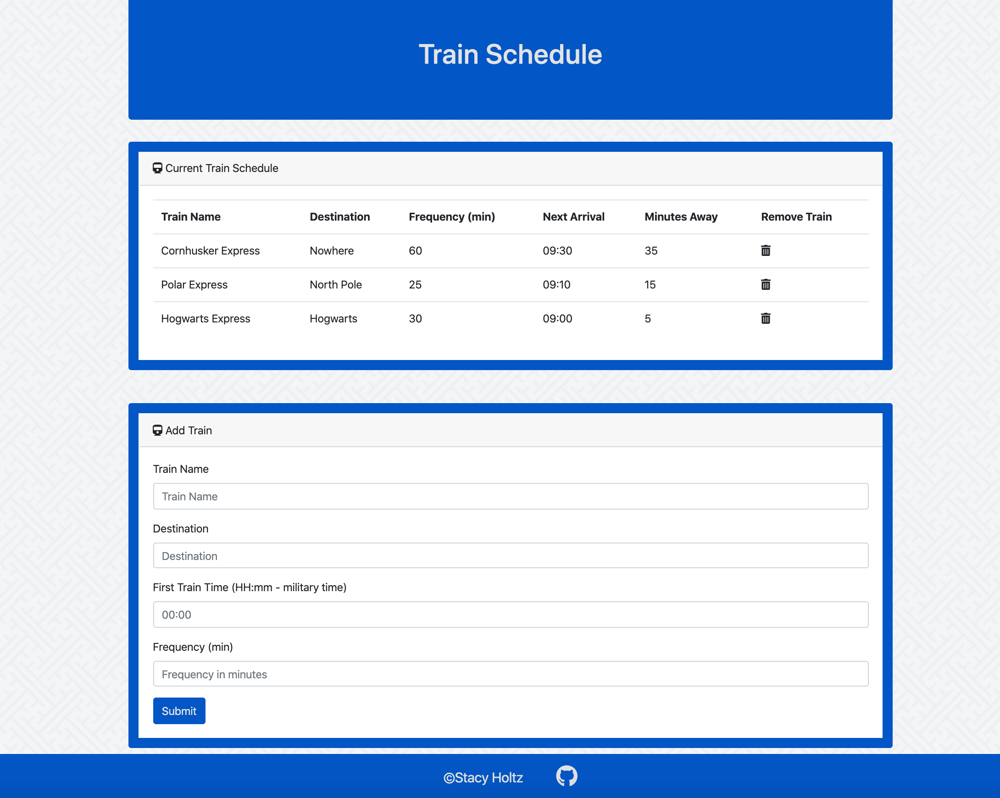
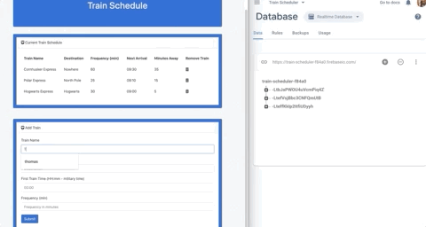
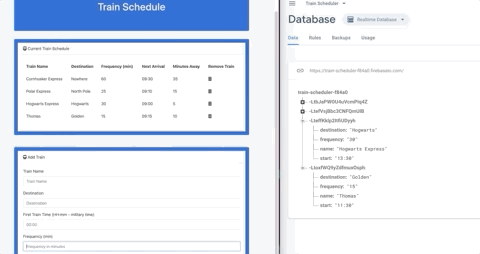

# Train-Scheduler

### Link to Live Game:
[Train-Scheduler](https://stacyholtz6.github.io/Train-Scheduler/)

## Objective:
```
--- Add and remove trains to the schedule. 
```
##### Instructions:
```
1. Enter any name of a "train" to the schedule.
2. Enter any destination.
3. Enter a time in 24 hour format.
4. Enter the frequency of the train arrival. 
5. Click submit to add the train. 
5. Watch as the train is added to the schedule.
6. Next arrivial time and minutes away is calculated for you.

```
## Tools/Languages Used:
```
--- Javascript
--- JQuery
--- Bootstrap
--- HTML/CSS
--- Moment.js
--- Firebase Database
```
## Features:

##### Landing Page:
```
--- Train table showing trains that have been added.
--- Add train form for user to fill out. 
```


#### Examples:

##### Add Train:
```
- Add a train to the table and watch moment.js calculate train times.
- Notice that the train is added to the table and Firebase. 
```


###### Remove Train
```
- Click on the trash can to remove the train.
- Train is removed from table and Firebase. 
```



